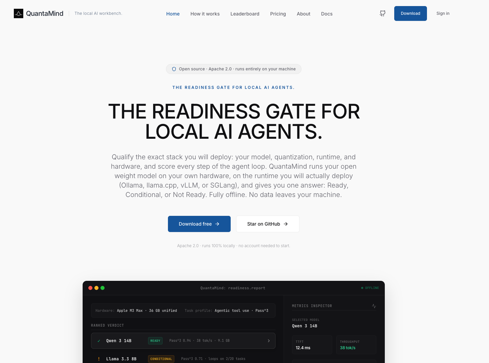
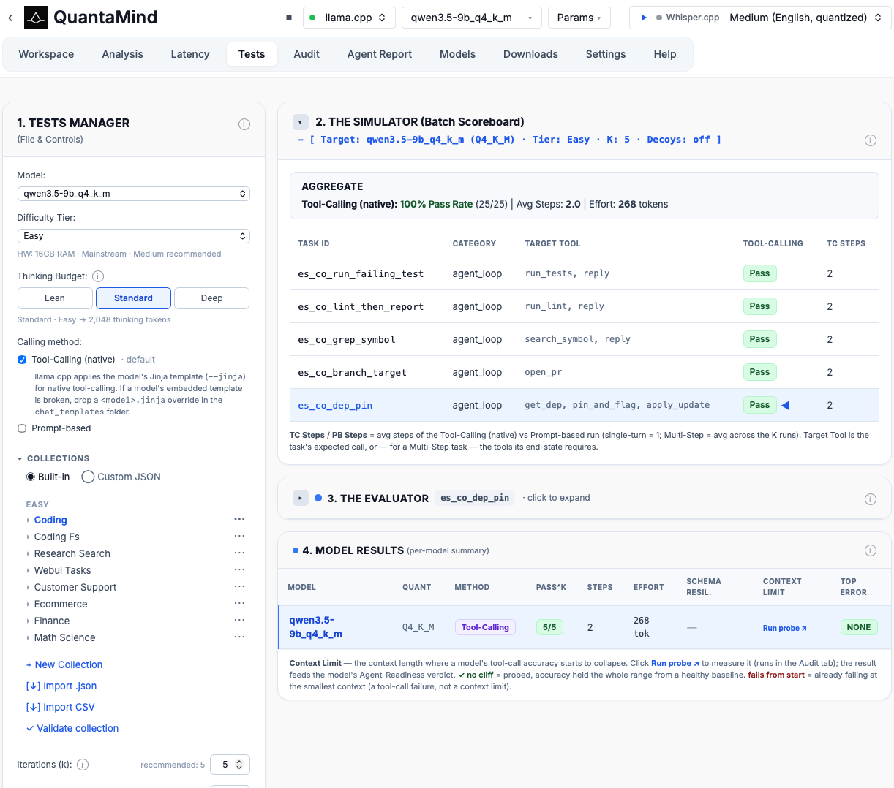
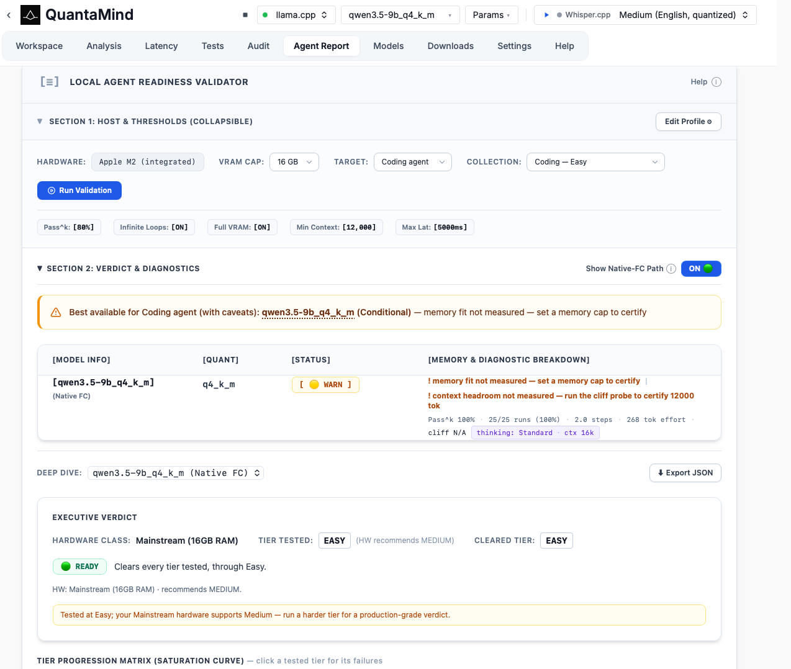

<div align="center">

# QuantaMind

**The pre-deployment gate for local AI agents.**

Benchmark any **Ollama**, **llama.cpp**, or **MLX** model for *agentic readiness* on your own hardware — and get a **Ready / Conditional / Not Ready** verdict before you wire it into an agent. Runs fully local by default (nothing leaves the machine); optionally point it at a **remote vLLM or SGLang** GPU server when you need to bench a model bigger than your box.

<sub>Local-first · No telemetry · No account · pass^k scoring · hardware-aware · one ~30 MB binary</sub>

<br/>


[](https://github.com/QuantaMinds/QuantaMind)
[](https://quantamind.co/)
[](https://discord.gg/6CjSJyZTfG)

<br/>



</div>

---

## Why

Parameter count is a terrible predictor of whether a local model can drive an agent. In Docker's open agent-loop benchmark, **Llama 3.3 70B scored 0.61** on tool-calling while **Qwen3 8B scored 0.97** — a model ~20× smaller was far more reliable.

The same model that's flawless in chat will, mid-task, fake a tool call, loop until it gives up, or declare "done" without finishing. On local hardware the result also shifts with **quantization and VRAM** — so a cloud eval's verdict doesn't transfer to your machine.

**QuantaMind is the gate you run before that happens.** Point it at a local model, and it drives that model through real agentic tasks — multi-step plans, tool calls, recovery — then returns a verdict for *that model on that hardware*:

| Verdict | Meaning |
|---|---|
| 🟢 **Ready** | Reliable enough to wire into an agent here. |
| 🟡 **Conditional** | Works for some task tiers, not others. The report says which. |
| 🔴 **Not Ready** | Fails the tasks that matter — with the failure mode named. |

Reliability is scored with **pass^k** — does the model succeed *k* of *k* times, not once by luck. For an agent, consistency is the whole game.

> [!IMPORTANT]
> Everything runs on your machine. There is no QuantaMind cloud, no account, no telemetry. Your prompts and model outputs never leave your hardware.

---

## Quick start

**Prefer the terminal?** Install the headless `qm` CLI in seconds — no Rust, no build, no toolchain:

```bash
# macOS / Linux
curl -fsSL https://github.com/QuantaMinds/QuantaMind/releases/latest/download/quantamind-installer.sh | sh
```

```powershell
# Windows
powershell -ExecutionPolicy Bypass -c "irm https://github.com/QuantaMinds/QuantaMind/releases/latest/download/quantamind-installer.ps1 | iex"
```

Then `qm doctor` → `qm init` gets your first verdict (every failure prints its exact fix). Full reference, static-musl/container binaries, checksums + attestation verification: **[CLI quickstart](./docs/cli/README.md#quickstart--three-commands-to-your-first-verdict)**. You'll still need [Ollama](https://ollama.com/) (or another backend) running with a model pulled ([Step 2](#quick-start) below).

**Want the desktop app?** Download a prebuilt build from **[quantamind.co](https://quantamind.co/)** and launch — no toolchain needed.

> **macOS + "developer cannot be verified"?** Our builds aren't Apple-signed *yet* (in progress). The curl install above is unaffected. For a browser-downloaded app/binary: right-click → Open, or `xattr -d com.apple.quarantine <file>` — details + integrity checks in [Troubleshooting](./docs/reference.md#macos-gatekeeper).

**Building from source** (contributors) takes ~5 minutes. macOS is first-class today; Windows and Linux dev builds run too, with sidecar lifecycles being rewired phase-by-phase (see [Roadmap](#roadmap)).

**1 · Install toolchains** (skip any you already have)

<table>
<tr><th>macOS</th><th>Linux (Debian / Ubuntu)</th><th>Windows</th></tr>
<tr valign="top"><td>

```bash
brew install rust node pnpm ollama
xcode-select --install
```

</td><td>

```bash
# Tauri system deps
sudo apt update && sudo apt install -y \
  libwebkit2gtk-4.1-dev build-essential \
  curl wget file libxdo-dev libssl-dev \
  libayatana-appindicator3-dev \
  librsvg2-dev patchelf
# Rust, Node 20+, pnpm, Ollama
curl --proto '=https' --tlsv1.2 -sSf https://sh.rustup.rs | sh
curl -fsSL https://deb.nodesource.com/setup_20.x | sudo -E bash - \
  && sudo apt install -y nodejs
corepack enable pnpm
curl -fsSL https://ollama.com/install.sh | sh
```

</td><td>

```powershell
winget install Rustlang.Rustup OpenJS.NodeJS `
  pnpm.pnpm Ollama.Ollama `
  Microsoft.VisualStudio.2022.BuildTools
# Add "Desktop development with C++" in the
# VS installer (MSVC linker). WebView2 ships
# with Windows 11. Then see the "Windows dev
# shell" note below to source cargo + MSVC.
```

</td></tr></table>

**2 · Start Ollama + pull a small model to gate**

```bash
ollama serve &                 # Windows: runs as a service after install
ollama pull llama3.2:1b
```

**3 · Clone, install, run**

```bash
git clone https://github.com/QuantaMinds/QuantaMind.git
cd QuantaMind/frontend
pnpm install
pnpm tauri dev            # first build is slow; opens a native window
```

> On **Windows**, `cargo` and the MSVC linker must be on PATH before `pnpm tauri dev` — see the **Windows dev shell** note below.

Open the **Tests** tab, pick your model, run a built-in agentic collection for your first verdict — then check **Agent Report** for the per-model breakdown.

> 💬 Hit a snag? [Open an issue](https://github.com/QuantaMinds/QuantaMind/issues) — frictionless setup is a goal, so setup bugs are real bugs.

<details>
<summary><b>Prerequisites & optional backends</b></summary>

| Tool | Version | Required? |
|---|---|---|
| **Rust** | 1.75+ | required |
| **Node** | 20+ | required |
| **pnpm** | 9+ | required |
| **Ollama** | latest | required — the default backend |
| **llama.cpp** (`llama-server`) | latest | optional — run GGUF models directly |
| **MLX** (`pip install mlx-lm`) | latest | optional — Apple Silicon only |
| **vLLM** / **SGLang** | latest | optional — a **remote** OpenAI-compatible GPU server; set its URL (+ `--api-key`) in Settings |
| **whisper.cpp** | latest | optional — speech-to-text (`brew install whisper-cpp`) |

</details>

<details>
<summary><b>Windows dev shell</b> — one-time setup for <code>pnpm tauri dev</code></summary>

On Windows, source two things into your PowerShell session before `cargo` (and therefore `pnpm tauri dev`) can run: **the Rust bin dir on PATH** (rustup only updates *new* shells) and the **MSVC linker env** from Visual Studio's `vcvars64.bat`. macOS and Linux need neither.

If you hit `program not found: cargo metadata` or `linker link.exe not found`:

```powershell
# Refresh PATH for this session (already permanent on the User env var).
$env:Path = "$env:USERPROFILE\.cargo\bin;$env:APPDATA\npm;$env:LOCALAPPDATA\Programs\Ollama;$env:Path"

# Source MSVC env into PowerShell. Adjust the path for your VS version
# (2022\BuildTools, 2022\Community, or 18\Community for VS 2026).
$vcvars = "C:\Program Files\Microsoft Visual Studio\18\Community\VC\Auxiliary\Build\vcvars64.bat"
cmd /c "call `"$vcvars`" && set" |
  Where-Object { $_ -match "^(INCLUDE|LIB|Path|LIBPATH)=" } |
  ForEach-Object { $n,$v = $_ -split "=", 2; Set-Item -Path "env:$n" -Value $v }

cargo --version; link.exe /?      # both should print without error
cd path\to\QuantaMind\frontend
pnpm tauri dev
```

**pnpm 11 quirk (`ERR_PNPM_IGNORED_BUILDS: esbuild@…`):** the repo's `pnpm-workspace.yaml` pre-approves `esbuild`, so a fresh clone Just Works. On a stale worktree, re-pull `main`. Save the block above as `run-dev.ps1` if you spin up dev shells often.

</details>

---

## What's inside

QuantaMind is a workbench, not a chat app — each surface answers one question about a local model.

| Tab | What it's for |
|---|---|
| 🧪 **Tests** | Score models on tiered agentic scenarios (Easy→Extreme) with pass^k reliability, failure-mode classification, and a visual trace debugger. Includes a **Safety & Boundaries (Category K)** axis: prompt-injection resistance + an over-refusal control, a compliance gate, and model-vs-config attribution of a safety failure. Also reports **Tokens/Task** (amortized cost incl. failed-run waste) and supports **payload-noise** scenarios that test field extraction from messy real-world tool JSON. |
| 📋 **Agent Report** | Per-model **Ready / Conditional / Not Ready** verdict, tier-progression matrix, failure taxonomy, and an opt-in community leaderboard. |
| ⌨️ **Workspace** | Monaco prompt editor with token-by-token streaming, per-run metrics (TTFT, tok/s), and YAML save/load. |
| 🎙️ **Speech-to-Text** | Fully local transcription via whisper.cpp, with an optional voice → assistant pipeline. |
| 📦 **Models** | Install from Ollama Library, Hugging Face, or a local `.gguf`; disk-safe, resumable, with a storage manager. |
| 📊 **Analysis & Latency** | Multi-model compare and quantization diffing, with throughput/TTFT charts and Markdown/JSON export. |
| 📖 **Docs** | Built-in, task-oriented user guides (getting started, choosing a backend, running tests, troubleshooting) with ⌘K full-text search. |



<details>
<summary><b>The details behind each tab</b></summary>

**Tests** — Graduated tiered scenarios spanning coding, finance, medical, legal, ecommerce, support, supply-chain, math/science, and clinical-trial domains. Each difficulty tier offers **three** collections — one per domain, a coding·finance·medical spine so a model is comparable as difficulty rises. Deterministic sandbox-free scoring (tool-call accuracy, pass^k, avg steps, schema resilience, dominant failure mode). A **Difficulty Tier** control recommends pass^k iterations and step budgets per tier; an **Anti-Saturation** toggle injects decoy tools to resist contamination. Run a whole collection, or **click one task to run just it** (Built-In, Custom JSON, or MCP) — the Simulator, live Evaluator trace, and Model Results all scope to that task while every run lever (k, max steps, decoys, thinking budget, params, model, native/prompt method) applies unchanged. Failure modes are named honestly — `ForbiddenCall`, `LoopCap`, `FakeDone`, `foreign_dialect`, `empty_output`, `Reasoning-overrun` — never just pass/fail. A **Thinking-model** flag (auto-detected) raises the token budget and strips `<think>` scratchpads so a reasoner isn't scored as malformed. A **Context Stress Test** finds the prompt length where tool-call accuracy collapses — and only ever reports a depth it actually measured: the ladder is capped to fit the model's real context window (past it Ollama silently truncates the prompt and pins its own token counter, which would fabricate a cliff at the window from a model that never degraded), and depth counts the context the model *read*, including llama.cpp's cached prefix. Deterministic environments let a task run against a **simulated filesystem** the agent browses with `read_file`/`list_dir`/`grep`, replayed visually in a step-scrubber. Custom collections are **validated before they're written**: JSON import shows a format guide with a copyable template, dry-runs the answer-key checks on the file (unreachable entity IDs, getters that return no data, field-scoped getters naming a nonexistent field, leakable oracle keys), and blocks a broken import with per-task fix-it messages — so a fixture bug can never masquerade as "every model fails my task".

**Agent Report** — Verdict gated on your configurable readiness profile (min pass^k, forbid loops/false-done, require full VRAM, min context, require native FC). Both tool-calling paths (Native FC / Prompt-Based) get a separate verdict row. Hardware-aware VRAM fit (exact weights + KV cache vs an allocation cap) — for a llama.cpp model, graded at the KV-cache precision its launch would actually use (a Q8 cache under memory pressure, with an explicit advisory). A **Right-Sizing** section names the smallest quant of each family still Ready on your hardware vs the largest, with measured percent reductions (size · memory · Pass^k delta — percentages only, never dollar figures). A per-model deep-dive shows an Executive Verdict, Tier Progression Matrix, and Failure Taxonomy. Export as standalone HTML, or publish a verdicts-and-metrics-only row (opt-in, default-off — never prompts, traces, machine identifiers, or host-specific right-sizing). The page's **Equivalent CLI command** preview emits a runnable `qm report` chain that writes a `profile.json` with the exact thresholds active on the page — so the headless verdict always grades the same bar as the UI, even for an edited profile.

**Workspace** — Live model picker driven by `/api/tags`, explicit `running`/`streaming`/`done`/`cancelled`/`error` states, clean stream cancellation (no fake "done"), byte-identical YAML round-trip, and a persistent status bar with Ollama health.

**Speech-to-Text** — whisper.cpp (`whisper-server`) on a fixed `:8093`, its own engine axis parallel to the LLM backend. Curated model catalog, atomic both-or-none installs, audio decoded/downmixed/resampled to 16 kHz in Rust. Offline-only by construction — a loopback-only probe means transcription never silently reaches the cloud.

**Models** — One modal, three sources. Disk pre-check refuses any install leaving < 2 GB free. Real-time progress (bytes/speed/ETA), cancellable, resumable HF downloads (`.partial` + Range), pure-Rust GGUF header parsing, and an 8-family chat-template registry.

**Analysis** — Multi-select models, one prompt, three run strategies with a hardware feasibility verdict (`ok`/`risky`/`wont_fit`) computed at click time. Per-model streaming columns, and — directly below each answer — the full per-token latency breakdown from the **Latency** tab (TTFT phase track, cold-load / prefill / inter-token cards, token-timing chart, latency histogram, VRAM & context-ceiling meters), then a throughput/TTFT chart and word-level diff. (Per-quant right-sizing guidance lives on the **Agent Report** page.) The **Latency** tab (kept as its own view) adds "context ceiling by KV cache precision" meters — how much context your machine holds for a model at f16 / q8_0 (≈2×) / q4_0 (≈4×, with quality + long-context speed caveats). On Apple Silicon the budget is the GPU's **measured Metal working-set limit** (the ~66-75% of unified memory the GPU can actually wire down — read from the Metal API, not raw RAM), and a **fit verdict** (`Fits`/`Tight`/`SpillsToCpu`) says whether the weights fit under that limit at all — the question a large ceiling can't answer (a 100K ceiling is meaningless if the model doesn't load on the GPU). Capacity, not capability: the meter measures memory only, never speed or quality at that context. These read the model that's currently loaded in memory (measured, never fabricated) — including a `llama-server` you started yourself or via the `qm` CLI, not only one the app launched.

**Latency ⇢ Tests link** — The Latency tab is the **Test-run cost page** (workspace per-token timing lives under Analysis, right below each answer): run a task (or a whole collection — Built-In, Custom JSON, or MCP) on the Tests tab and see, per task, what it actually cost on your box — prefill/decode split per agent step, thinking tokens, prompt-cache hits (measured on llama.cpp; honestly "Not available" on Ollama, which doesn't report cache reuse), and a stacked memory answer: weights in VRAM (measured) + the KV cache at that task's peak context (computed from measured tokens on llama.cpp, estimated elsewhere — always labeled which) + a fits/tight/won't-fit verdict for *this* agent workload on *this* machine. If a task dies of a real out-of-memory, the panel names the task and step and computes the context ceilings (f16/q8_0/q4_0 KV) that would fit instead. Every number carries its provenance — measured, computed from measured tokens, estimated, or the model tag's unverified claim.

</details>



---

## Roadmap

- **Windows + Linux** desktop builds — *in progress*. The platform-adapter foundation has landed; sidecar lifecycles, multi-vendor GPU probe, and native storage paths are being rewired phase-by-phase.
- **WebGPU** — run the readiness gate in the browser, on your own GPU, zero install.
- **Expanded task suite** — more agentic tiers and domains.
- **Deterministic visual environments** — stateful WebUI + vision/OCR readiness evals.
- **Category K, broadened** — more injection vectors (sleeper, contradictory params, parameter validation), a visual authoring toggle for custom safety probes, and a redacted auditor-evidence export.

---

## Tech stack

Tauri 2.x + Rust + React 19 + TypeScript 5 + Vite + Tailwind + Zustand. These choices are **locked** — substitutions require explicit review.

<details>
<summary><b>Full dependency table</b></summary>

| Layer | Choice | Why |
|---|---|---|
| Desktop shell | **Tauri 2.x** | ~30 MB binaries, native WebView, Rust backend |
| Backend language | **Rust 1.75+** (ed. 2021) | Tauri default; safe IPC + HTTP |
| Frontend | **React 19 + TypeScript 5** | Largest open-source contributor pool |
| Build tool | **Vite 7** | Fast HMR, Tauri-friendly |
| Styling | **Tailwind CSS 3** | Utility-first, no design-system overhead |
| State | **Zustand** | ~1 KB, no boilerplate, scales |
| Editor | **`@monaco-editor/react`** | Same editor as VS Code |
| HTTP client (Rust) | **`reqwest` + `tokio`** | Battle-tested |
| Speech-to-text | **whisper.cpp** (`whisper-server` sidecar) | Local STT over HTTP on `:8093`; subprocess, not FFI |
| Audio preprocessing | **`hound` + `rubato`** | Decode WAV → downmix → resample to 16 kHz in-process |
| Voice-activity detection | **`webrtc-vad`** | Independent non-ML VAD for the silence-hallucination metric |
| Serialization | **`serde` / `serde_json` / `serde_yaml`** | Type-safe across IPC |
| Validation | **`zod`** (TS) · **`validator` + `serde`** (Rust) | Runtime schema validation at the IPC boundary |
| Testing | **`cargo test` + `mockito`** · **`vitest` + Testing Library** | Built-in, fast |
| Format / Lint | **`rustfmt` + Clippy** · **Prettier + ESLint** | Auto-format on save |
| Pre-commit / CI | **`lefthook`** · **GitHub Actions** | Lighter than Husky; free for OSS |

**Deliberately not installed (yet):** no logging library, no state-machine library, no UI component library, no form library, no in-process AI/ML libraries. Every dependency is a maintenance debt.

</details>

---

## Architecture

```
┌──────────────────────────────────────────────┐
│           React + TypeScript Frontend        │
│    features/  ←  shared/ipc/  ←  invoke()    │
└─────────────────────┬────────────────────────┘
                      │  IPC boundary (JSON)
┌─────────────────────▼────────────────────────┐
│              Rust Backend (backend/)         │
│   commands/  →  inference/  →  metrics/      │
│                    ↓                          │
│               persistence/                    │
└─────────────────────┬────────────────────────┘
                      │  HTTP
                      ▼
    Ollama · llama.cpp · MLX  (local)   ·   vLLM · SGLang  (remote GPU)
```

The two halves talk JSON over Tauri's IPC — contracts explicit in `shared/ipc/types.ts`, mirrored in Rust, no codegen. `shared/ipc/` is the **only** place that calls `invoke`. Each file is single-concern; each module owns one responsibility.

> **New here?** [`ARCHITECTURE.md`](ARCHITECTURE.md) is the five-minute map of the backend's hexagonal layout and the one dependency rule that keeps it navigable.

---

## Building from source

```bash
cd frontend
pnpm install
pnpm tauri dev            # development, with HMR
pnpm tauri build          # production → backend/target/release/bundle/ (.dmg + .app)
```

macOS is the shipping target today; Windows and Linux are being rewired phase-by-phase (see [Roadmap](#roadmap)).

```bash
cd frontend && pnpm test          # frontend (vitest)
cd backend  && cargo test         # backend (cargo test + mockito)
```

---

## Documentation

The README stays lean on purpose. Depth lives in `docs/`:

- **[`docs/codebase/`](./docs/codebase/README.md)** — deep, file-by-file reference for every backend module and frontend page (**Why** it exists, **What** it does, **How/Where** it's used). Jump to [inference engines](./docs/codebase/backend-inference-backends.md), [the eval engine](./docs/codebase/backend-eval-engine.md), [STT](./docs/codebase/backend-stt.md), or [the Workspace tab](./docs/codebase/frontend-workspace.md).
- **[`docs/architecture.md`](./docs/architecture.md)** — modules, IPC, layering law, robustness rules, folder taxonomy.
- **[`docs/process.md`](./docs/process.md)** — tech stack, setup, conventions, the step-by-step workflow, roadmap.
- **[`docs/reference.md`](./docs/reference.md)** — analysis/bench schema and troubleshooting.
- **[`docs/cli/README.md`](./docs/cli/README.md)** — the headless `qm` CLI, with a **[three-command quickstart](./docs/cli/README.md#quickstart--three-commands-to-your-first-verdict)** (build → `qm doctor` → `qm init`; connecting takes seconds once built). `qm doctor` diagnoses every backend (reachable? models? credential? tool-calling?) and tells you exactly what to fix; `qm init` auto-detects a backend and runs the suite with zero config; `qm run` prints a Ready/Conditional/NotReady verdict with a CI-gateable exit code.

---

## Contributing

Contributions welcome. The engineering principles are non-negotiable — start with [`CLAUDE.md`](./CLAUDE.md) and [`docs/process.md#workflow`](./docs/process.md#workflow).

**Before you open a PR:**

- [ ] Single concern (one feature, bug, or refactor)
- [ ] Each file stays single-concern — split by responsibility, not line count
- [ ] Tests added/updated and passing — *and outputs verified* (a green CI run is necessary, not sufficient)
- [ ] Docs in `docs/` updated in the same PR
- [ ] No `unwrap()` outside tests
- [ ] Commits follow [Conventional Commits](https://www.conventionalcommits.org/); branches are `<type>/<short-description>` (`feature/`, `fix/`, `bug/`, `docs/`, `chore/`, `refactor/`)

---

## Security & privacy

> [!IMPORTANT]
> QuantaMind is local-first by design.

- **No telemetry, no account** — no analytics SDK, no crash reporting, no tracking. Runs offline once a model is installed.
- **Network calls limited to** local model servers (`localhost:11434` Ollama, `127.0.0.1:8093` whisper.cpp, dynamic llama/MLX ports) and `huggingface.co` (only when you actively browse/install). The one exception is **opt-in**: if you configure a remote vLLM/SGLang server in Settings, prompts you run on that backend are sent to the URL you entered (empty by default).
- **Speech-to-text is offline-only** — a loopback-only probe; a down local server fails loud rather than silently falling back.
- **No silent shell edits** — changing `OLLAMA_MODELS` *generates* the export command; it never edits your shell profile.
- **Tauri sandboxing** — the webview can only call IPC commands explicitly registered in `backend/capabilities/`.
- **Schema validation at every IPC boundary** — Zod on TS, serde + `validator` on Rust; malformed payloads rejected with typed errors.

Found a vulnerability? Please open a [private security advisory](https://github.com/QuantaMinds/QuantaMind/security/advisories/new) instead of a public issue.
---
### Community

- [Discord](https://discord.gg/6CjSJyZTfG)
- [𝕏 (Twitter)](https://x.com/QuantaMind_2025)
---

## FAQ

<details>
<summary><b>Is QuantaMind a chat app?</b></summary>

No — it's a workbench. Each Workspace run is a single prompt → single completion. The multi-step **agentic** loops live in the eval engine, not a chat UI.

</details>

<details>
<summary><b>Does it fine-tune or train models?</b></summary>

No. QuantaMind consumes pre-trained models; training is out of scope.

</details>

<details>
<summary><b>Why Ollama and not llama.cpp directly?</b></summary>

Ollama gives a clean HTTP API, a stable storage convention, and handles GPU plumbing. It's no longer the only backend, though — llama.cpp (`llama-server`) and MLX (`mlx_lm`, Apple Silicon) run locally, and vLLM / SGLang connect to a remote OpenAI-compatible GPU server (URL + optional API key set in Settings) — all behind one `InferenceBackend` trait.

</details>

<details>
<summary><b>Does my audio leave the machine?</b></summary>

No. Speech-to-text runs entirely on local whisper.cpp (`127.0.0.1:8093`). Audio is decoded and resampled in Rust and sent only to the local server; a loopback-only probe means it never reaches the cloud.

</details>

<details>
<summary><b>Can I run without an internet connection?</b></summary>

Yes, once you've installed at least one model. Workspace, Voice, and Analysis are fully offline. Only the Hugging Face tab — and downloading new models — needs connectivity.

</details>

<details>
<summary><b>Does it send any usage data?</b></summary>

None. The only outbound HTTP is to your local Ollama and (when you ask) to Hugging Face.

</details>

---

## License & acknowledgements

Apache 2.0 — see [`LICENSE`](./LICENSE).

Built on [Tauri](https://tauri.app/), [Ollama](https://ollama.com/), [llama.cpp](https://github.com/ggerganov/llama.cpp), [whisper.cpp](https://github.com/ggerganov/whisper.cpp), [Hugging Face](https://huggingface.co/), [Monaco Editor](https://microsoft.github.io/monaco-editor/), and the [React](https://react.dev/) / [Vite](https://vitejs.dev/) / [Tailwind](https://tailwindcss.com/) / [Zustand](https://github.com/pmndrs/zustand) stack — plus the open-weights model communities (Meta, Mistral, Qwen, Microsoft, Google, DeepSeek, and many others).

<div align="center">
<br/>
<sub><b>Built with discipline. Local-first by design.</b> · Made by QuantaMind</sub>
</div>
